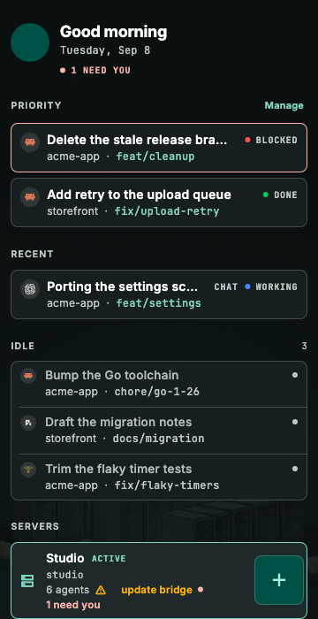
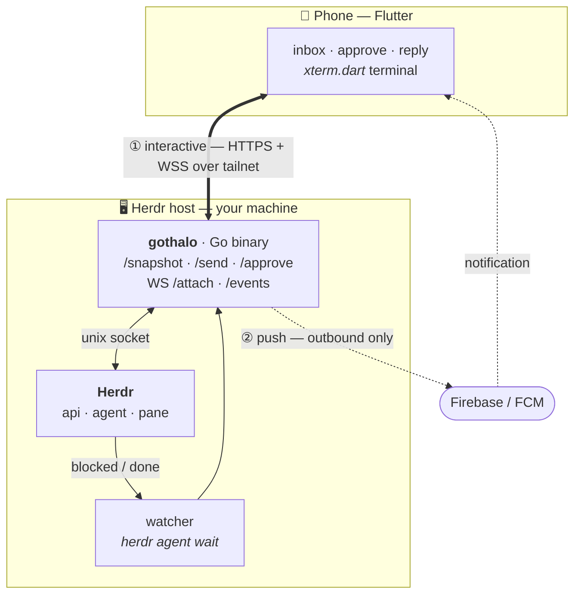

# gothalo

[](https://github.com/dipeshdulal/gothalo/actions/workflows/ci.yml)
[](LICENSE)

A self-hosted mobile remote for [Herdr](https://getmoshi.app/docs/herdr) — control your
coding agents (Claude Code, Codex, Gemini, Cursor, …) from your phone: see which
agents are blocked/working/done, get pushed when one needs you, approve or type a
reply, and drop into a full terminal — all over your own Tailscale network.

<p align="center">
  
</p>

<p align="center"><sub>
  Home: what needs you, what you were last in, everything else by state.<br>
  Rendered from fixtures by <code>app/test/screenshots_test.dart</code>.
</sub></p>

## Why this exists

Herdr exposes an open, documented socket API for driving agent sessions. gothalo is
a small self-hosted client on top of it — a Go bridge plus a Flutter app — shaped
around how my team actually works, and kept on our own Tailscale network so session
data and terminal traffic never leave it.

It's built for me and a few teammates rather than as a product. Android and web
only, no iOS. Push needs your own Firebase project ([`docs/PUSH.md`](docs/PUSH.md)).
If you want a polished, supported mobile client for Herdr, use
[Moshi](https://getmoshi.app) — it's considerably more capable than this.

## Architecture



Two independent paths:

- **Interactive** (snapshot / type / terminal): phone → bridge over the
  **tailnet**. No public ports, no SSH on the phone. The tailnet *is* the auth
  boundary; a per-device bearer token lets us revoke a single phone.
- **Push** (notifications): the bridge reaches **outbound** to Firebase/FCM, so
  it works on any network with zero inbound exposure. A phone can't run
  `herdr agent wait` — the bridge does, and calls FCM on `blocked`/`done`.

Because Herdr normalizes ~20 agents *below* the API (`agent:"claude"`,
`agent:"codex"`, …) into a uniform `idle/working/blocked/done` model, the app is
agent-agnostic by construction — multi-agent support is basically free.

The bridge watches **every running Herdr session**, so pane ids that leave the
bridge are session-qualified (`<session>/<pane>`) when they aren't from the
default session.

## Stack

| Layer | Choice | Why |
|---|---|---|
| Bridge | **Go** | Same as my other services; tiny; shells out to `herdr` |
| Transport | **Tailscale** | Already running; no port-forward, no public exposure |
| Push | **Firebase / FCM** | Free for a small team; outbound-only |
| App | **Flutter** | `xterm.dart` is a *native* terminal widget (RN would need xterm.js in a WebView) |
| Terminal | **xterm.dart** | Renders the `attach` stream; themes/fonts for free |

**Runs at zero recurring cost.** Herdr, Tailscale, FCM and the libraries are all
free at this scale. iOS is the only thing that would cost anything (an Apple
Developer account, $99/yr) and it is not built — the notification contract is
Android-only, and the app also runs as a PWA the bridge serves itself.

## Repo layout

One Go binary (`gothalo`) is both the daemon and the CLI.

```
cmd/gothalo/   thin entrypoint -> internal/cli
internal/      the bridge: cli · config · herdr · watcher · push · store ·
               pairing · server · transport · events · agentstate ·
               transcript · gitdiff · notify · web
app/           Flutter app (lib/{core,data,features})
bruno/         HTTP collection for poking the API by hand
docs/          API.md · ARCHITECTURE.md · CONTRACT-*.md · PUSH.md · TESTING.md
CONTRACT.md    WS /events — the event stream the app codes against
```

Runtime state lives **outside** the repo in `~/.gothalo` (`$GOTHALO_DIR`):
`config.json`, `devices.json`, the FCM key. Nothing secret is committed.

## Prerequisites (on the Herdr host)

Install Herdr's agent integration for every agent you run — **required**, or the
transcript view shows one agent's conversation under another:

```bash
herdr integration install claude   # likewise: hermes, codex, opencode, …
```

Why, and where each agent keeps its transcript:
[`docs/AGENT-INTEGRATION.md`](docs/AGENT-INTEGRATION.md).

## Run the bridge (on the Herdr host)

```bash
go install github.com/dipeshdulal/gothalo/cmd/gothalo@latest

gothalo serve            # first run writes ~/.gothalo/config.json + an admin token
gothalo-service install  # supervise it via launchd (macOS) / systemd (Linux)
gothalo pair             # QR-pair a phone
```

Defaults to `127.0.0.1:8787`. Point it at the tailnet so the phone can reach it:

```bash
GOTHALO_ADDR=$(tailscale ip -4):8787 \
GOTHALO_PUBLIC_URL=https://<host>.<tailnet>.ts.net:8787 \
gothalo serve
```

Config lives in `~/.gothalo/config.json`; env wins. The main overrides are
`GOTHALO_DIR`, `GOTHALO_ADDR`, `GOTHALO_PUBLIC_URL`, `GOTHALO_ADMIN_TOKEN`,
`GOTHALO_SERVICE_ACCOUNT` and `GOTHALO_FCM_PROJECT`.

No release is published yet, so `install.sh` has nothing to fetch until the
first tag. Build the app from `app/`; push stays inert until you point it at
your own Firebase project ([`docs/PUSH.md`](docs/PUSH.md)).

## Push notifications (optional)

Without credentials the bridge just logs instead of notifying. Two steps to turn
them on — credentials for the bridge, a Firebase project for the app:

```bash
gothalo push login --project <firebase-project-id>
./scripts/setup-firebase.sh --project <firebase-project-id>
```

Full walkthrough, including why every fork needs its own project:
[`docs/PUSH.md`](docs/PUSH.md).

## Pair a phone

```bash
./gothalo pair             # prints a QR: {"url":…,"code":…}, one-time, ~5 min TTL
./gothalo devices list
./gothalo devices revoke <id>
```

The app POSTs `{code, device_name, fcm_token}` to `/pair` and gets back a
**per-device bearer** it sends as `Authorization: Bearer …` from then on.

## Poke it by hand

The **admin token** (from `~/.gothalo/config.json`) works as a bearer for every
endpoint plus the `/admin/*` routes — dev-only, but it means no app is needed:

```bash
TOKEN=$(python3 -c 'import json,os;print(json.load(open(os.path.expanduser("~/.gothalo/config.json")))["admin_token"])')
curl -H "Authorization: Bearer $TOKEN" http://127.0.0.1:8787/snapshot
```

WebSocket routes (`/attach`, `/events`) take the token as `?token=…` instead,
since WS clients can't always set headers. See `docs/API.md` for the full surface
and `CONTRACT.md` for the event stream.

## Releasing (maintainer)

Releases are cut by GoReleaser from a semver tag; GitHub Actions
(`.github/workflows/release.yml`) does the rest:

```bash
git tag v0.1.0 && git push origin v0.1.0
```

This cross-compiles darwin/linux (amd64 + arm64), publishes a GitHub Release with
archives + `checksums.txt`, and generates the changelog. Dry-run locally with
`goreleaser release --snapshot --clean` (artifacts land in `dist/`).

## License

MIT — see [`LICENSE`](LICENSE).

Third-party assets keep their own terms: Inter and JetBrains Mono ship with
their SIL Open Font License texts in `app/assets/fonts/`, and the agent logos in
`app/assets/agents/` are their respective owners' trademarks, included to
identify the agents the app drives.
